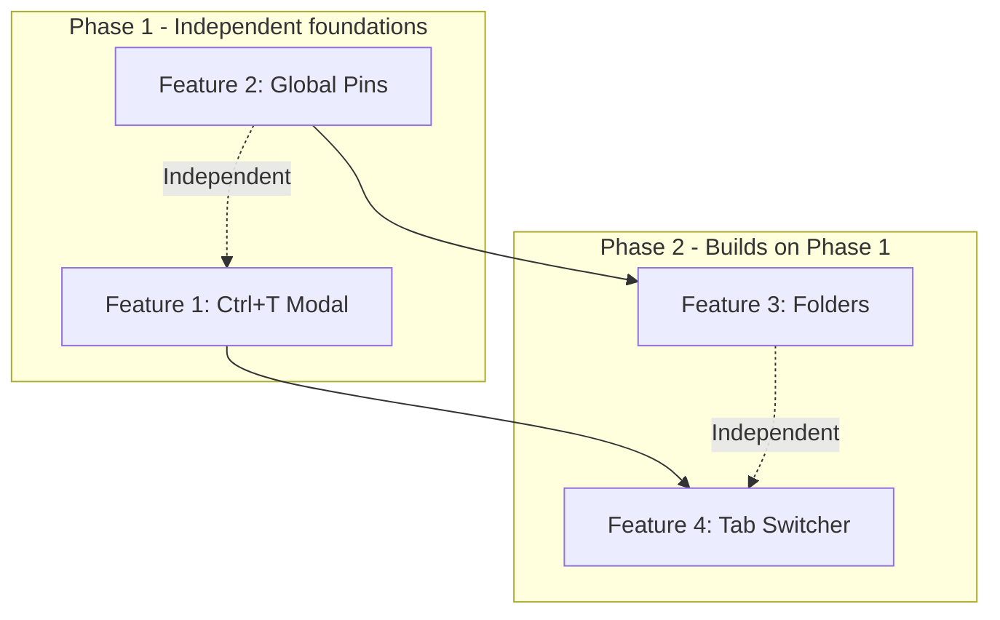
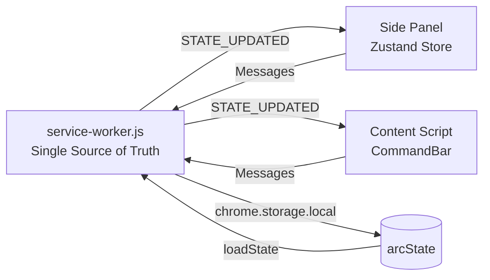
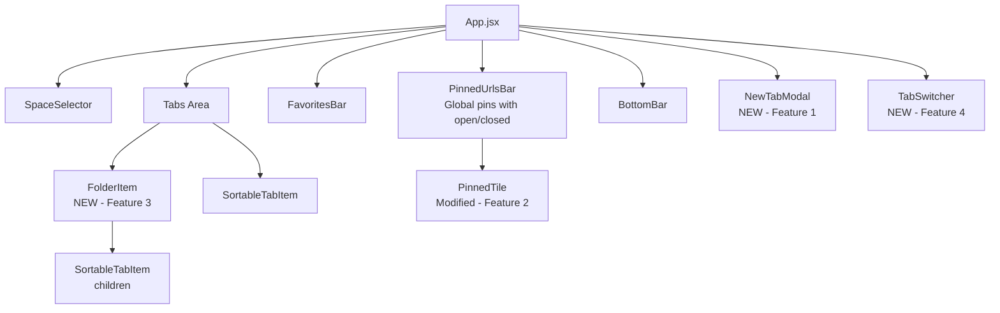
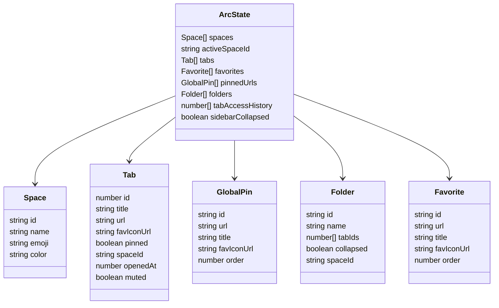

# Arc-like Extension — 4-Feature Implementation Plan

> Generated from full codebase review on 2026-04-13

---

## Table of Contents

1. [Feature 1: Ctrl+T New Tab Modal](#feature-1-ctrlt-new-tab-modal)
2. [Feature 2: Global Pinned URLs with Open/Closed State](#feature-2-global-pinned-urls-with-openclosed-state)
3. [Feature 3: Folders in Side Panel](#feature-3-folders-in-side-panel)
4. [Feature 4: Ctrl+Tab Modal Tab Switcher](#feature-4-ctrltab-modal-tab-switcher)
5. [Cross-Feature Implementation Order](#cross-feature-implementation-order)
6. [Architecture Diagram](#architecture-diagram)

---

## Feature 1: Ctrl+T New Tab Modal

A lightweight URL input modal that replaces the default Ctrl+T behavior with an inline input field, appearing primarily in the side panel and secondarily as a content script overlay.

### 1. State Changes

No persistent state changes needed. This is a **UI-only** feature with ephemeral local state.

| Field | Location | Type | Purpose |
|---|---|---|---|
| `newTabModalOpen` | Zustand store (local only) | `boolean` | Controls modal visibility in the side panel |

The modal's open/closed state lives only in the Zustand store and is **not** persisted to `chrome.storage.local` — it resets on side panel close.

### 2. Message Changes

Add to [`src/shared/messages.js`](src/shared/messages.js):

```
OPEN_NEW_TAB_MODAL   — Sent from background to side panel / content script to open the modal
CREATE_TAB_WITH_URL  — Sent from side panel to background to create a tab with a specific URL
CLOSE_BLANK_TAB      — Internal: close the blank tab Chrome auto-created on Ctrl+T
```

### 3. Background Changes

Modify [`src/background/service-worker.js`](src/background/service-worker.js):

- **New command handler** in `chrome.commands.onCommand.addListener` for `'new-tab-modal'`:
  1. Query the active tab — if it's `chrome://newtab`, close it via `chrome.tabs.remove()`
  2. Send `OPEN_NEW_TAB_MODAL` to side panel via `chrome.runtime.sendMessage()`
  3. Also send `OPEN_NEW_TAB_MODAL` to the previously-active content tab via `chrome.tabs.sendMessage()` (best-effort, for overlay)
- **New message handler** for `CREATE_TAB_WITH_URL`:
  1. Validate/normalize the URL (prefix `https://` if no protocol)
  2. Call `chrome.tabs.create({ url })` 
  3. Return updated state

- **`chrome.tabs.onCreated` listener modification**: When a new tab is created with url `chrome://newtab` and the `new-tab-modal` command was *just* fired (track via a short-lived flag/timestamp, ~500ms window), auto-close that tab and send `OPEN_NEW_TAB_MODAL` instead.

### 4. Store Changes

Modify [`src/sidepanel/store.js`](src/sidepanel/store.js):

- Add local state field: `newTabModalOpen: false`
- Add actions:
  - `openNewTabModal: () => set({ newTabModalOpen: true })`
  - `closeNewTabModal: () => set({ newTabModalOpen: false })`
  - `createTabWithUrl: async (url) => { await sendMessage(Messages.CREATE_TAB_WITH_URL, { url }); set({ newTabModalOpen: false }) }`
- In the `load()` action's message listener, add handler for `OPEN_NEW_TAB_MODAL` → `set({ newTabModalOpen: true })`

### 5. Component Changes

#### New: `src/sidepanel/components/NewTabModal.jsx`

- Renders when `newTabModalOpen === true`
- Dark-themed floating modal with a single `<input>` field
- Auto-focuses on mount
- On **Enter**: validate input, call `createTabWithUrl(url)`, close modal
- On **Escape**: call `closeNewTabModal()`
- **Click outside** (backdrop): call `closeNewTabModal()`
- URL detection: if input looks like a URL, navigate directly; otherwise, open Google search
- Simple URL validation with the same `isUrl()` helper already in [`CommandBar.jsx`](src/commandbar/CommandBar.jsx:10)

#### Modify: `src/sidepanel/components/BottomBar.jsx`

- Change [`handleNewTab`](src/sidepanel/components/BottomBar.jsx:7) from `chrome.tabs.create({})` to `useStore.getState().openNewTabModal()`
- The "New Tab" button now opens the modal instead of creating a blank tab

#### Modify: `src/sidepanel/App.jsx`

- Import and render `<NewTabModal />` conditionally when `newTabModalOpen` is true
- Add keydown listener for `Ctrl+T` in the side panel:
  ```js
  if (e.ctrlKey && e.key === 't') {
    e.preventDefault()
    openNewTabModal()
  }
  ```

#### Modify: `src/commandbar/main.jsx` (best-effort content script overlay)

- Add listener for `OPEN_NEW_TAB_MODAL` message → render a simplified URL input overlay (reuse the shadow DOM host pattern)
- On Enter → `chrome.runtime.sendMessage({ type: Messages.CREATE_TAB_WITH_URL, url })`
- On Escape → dismiss

### 6. CSS Changes

Add to [`src/sidepanel/sidepanel.css`](src/sidepanel/sidepanel.css):

- `.new-tab-modal-backdrop` — fixed overlay, semi-transparent dark background
- `.new-tab-modal` — centered card, dark theme (`#1E1E2E` background), rounded corners, subtle shadow
- `.new-tab-modal-input` — full-width input, large font, no border, white text, accent-colored caret
- `.new-tab-modal-hint` — small text below input showing "Enter to open · Esc to cancel"

### 7. File List

| File | Action |
|---|---|
| `src/shared/messages.js` | Modify — add 3 new message types |
| `src/background/service-worker.js` | Modify — add command handler, message handler, blank-tab interception |
| `src/sidepanel/store.js` | Modify — add `newTabModalOpen` state + actions |
| `src/sidepanel/App.jsx` | Modify — render NewTabModal, add Ctrl+T keydown |
| `src/sidepanel/components/NewTabModal.jsx` | **Create** — new modal component |
| `src/sidepanel/components/BottomBar.jsx` | Modify — wire "New Tab" button to modal |
| `src/sidepanel/sidepanel.css` | Modify — add modal styles |
| `src/commandbar/main.jsx` | Modify — add OPEN_NEW_TAB_MODAL listener (best-effort) |
| `manifest.json` | Modify — add `new-tab-modal` command with `Ctrl+T` suggested key |

### 8. Implementation Order

1. Add message types to `messages.js`
2. Add `new-tab-modal` command to `manifest.json`
3. Add background handler for command + `CREATE_TAB_WITH_URL` message + blank-tab interception
4. Add store state and actions in `store.js`
5. Create `NewTabModal.jsx` component
6. Add CSS styles
7. Wire up `App.jsx` (render modal + Ctrl+T keydown)
8. Wire up `BottomBar.jsx` button
9. Add content script overlay support in `main.jsx` (best-effort)

### 9. Edge Cases

- **Ctrl+T race condition**: Chrome creates a `chrome://newtab` tab *before* the extension can intercept. Solution: detect the blank tab in `onCreated` within a short time window after the command fires, then close it.
- **Manifest command conflict**: Chrome only allows 4 commands max (besides `_execute_action`). Currently 3 are used (`open-command-bar`, `duplicate-tab`, `toggle-sidebar`). Adding `new-tab-modal` makes 4 — at the limit. If Ctrl+Tab is also needed as a command, one must be removed or use a different approach.
- **Side panel not open**: If the side panel isn't open when Ctrl+T fires, the modal can't appear there. Fallback: let the content script overlay handle it, or open side panel first via `chrome.sidePanel.open()`.
- **URL vs. search ambiguity**: Input like `localhost:3000` or `github.com` should be detected as URLs. Reuse the existing `isUrl()` regex from `CommandBar.jsx`.
- **Focus trapping**: When the modal is open, keyboard events should not reach underlying tab items. Use `e.stopPropagation()` and focus lock.

---

## Feature 2: Global Pinned URLs with Open/Closed State

Move pinned URLs from per-space to global scope, with visual open/closed states that reflect whether an actual Chrome tab exists for each pin.

### 1. State Changes

**Before:**
```
Space: { id, name, emoji, color, pinnedUrls: PinnedUrl[] }
```

**After:**
```
Space: { id, name, emoji, color }                     // pinnedUrls REMOVED
State: { ..., pinnedUrls: GlobalPin[] }                // NEW top-level array
```

**New type — `GlobalPin`:**
```
{
  id: string,           // UUID
  url: string,          // canonical URL
  title: string,        // display title
  favIconUrl: string,   // favicon
  order: number         // sort position
}
```

The **open/closed state is derived at render time**, not stored:
- **Open** = `state.tabs.some(t => t.url === pin.url)` — a live Chrome tab matches the pin's URL
- **Closed** = no matching tab exists

This avoids stale data and keeps the state shape simple.

**Migration** needed on `loadState()`:
1. If `state.spaces[].pinnedUrls` exist AND `state.pinnedUrls` does not exist:
   - Merge all per-space `pinnedUrls` arrays into a single deduplicated `state.pinnedUrls[]`
   - Deduplicate by URL, keeping the first occurrence
   - Strip `pinnedUrls` from each space object
2. If both exist (partial migration), merge and dedupe
3. If only `state.pinnedUrls` exists, no action needed

### 2. Message Changes

Replace in [`src/shared/messages.js`](src/shared/messages.js):

```
PIN_URL       → Messages.PIN_URL        (was raw string 'PIN_URL')
UNPIN_URL     → Messages.UNPIN_URL      (was raw string 'UNPIN_URL')
REORDER_PINS  → Messages.REORDER_PINS   (was raw string 'REORDER_PINS')
```

Also fix the known inconsistency: the store currently uses raw strings `'PIN_URL'` / `'UNPIN_URL'` / `'REORDER_PINS'` instead of the `Messages` enum. These must be added to the enum and updated in both store and background.

**Payload changes:**
- `PIN_URL`: remove `spaceId` param — now global: `{ url, title, favIconUrl }`
- `UNPIN_URL`: remove `spaceId` param: `{ pinId }`
- `REORDER_PINS`: remove `spaceId` param: `{ ids }`

### 3. Background Changes

Modify [`src/background/service-worker.js`](src/background/service-worker.js):

- **`loadState()` migration logic**: After loading from storage, run the migration described above
- **Default state**: Add `pinnedUrls: []` to the default state (line 72 area)
- **`PIN_URL` handler** (line 425): Change from per-space to global:
  ```js
  case Messages.PIN_URL: {
    if (state.pinnedUrls.some(p => p.url === message.url)) return state
    const pin = { id: crypto.randomUUID(), url, title, favIconUrl, order: state.pinnedUrls.length }
    state = { ...state, pinnedUrls: [...state.pinnedUrls, pin] }
    await saveState()
    return state
  }
  ```
- **`UNPIN_URL` handler** (line 454): Change from per-space to global:
  ```js
  case Messages.UNPIN_URL: {
    state = { ...state, pinnedUrls: state.pinnedUrls.filter(p => p.id !== message.pinId) }
    await saveState()
    return state
  }
  ```
- **`REORDER_PINS` handler** (line 468): Change from per-space to global
- **`onUpdated` listener** (line 210): Update favicon/title propagation to use `state.pinnedUrls` instead of `state.spaces[].pinnedUrls`
- **Remove `pinnedUrls` from `CREATE_SPACE`** (line 357): No longer needed in space objects

### 4. Store Changes

Modify [`src/sidepanel/store.js`](src/sidepanel/store.js):

- Add `pinnedUrls: []` to initial state
- Update `parseState()` to include `pinnedUrls: rawState.pinnedUrls ?? []`
- **`pinUrl`** (line 167): Remove `spaceId` parameter:
  ```js
  pinUrl: async (tab) => {
    const state = await sendMessage(Messages.PIN_URL, { url: tab.url, title: tab.title, favIconUrl: tab.favIconUrl })
    if (state) set(parseState(state))
  }
  ```
- **`unpinUrl`** (line 177): Remove `spaceId` parameter:
  ```js
  unpinUrl: async (pinId) => { ... }
  ```
- **`reorderPins`** (line 182): Remove `spaceId` parameter
- Add **`activatePinnedUrl`** action:
  ```js
  activatePinnedUrl: async (pin) => {
    const { tabs } = get()
    const matchingTab = tabs.find(t => t.url === pin.url)
    if (matchingTab) {
      // Open state: activate existing tab, switch space if needed
      if (matchingTab.spaceId !== get().activeSpaceId) {
        await sendMessage(Messages.SWITCH_SPACE, { spaceId: matchingTab.spaceId })
      }
      chrome.tabs.update(matchingTab.id, { active: true })
      set({ activeTabId: matchingTab.id })
    } else {
      // Closed state: create new tab in current space
      chrome.tabs.create({ url: pin.url })
    }
  }
  ```

### 5. Component Changes

#### Modify: `src/sidepanel/components/PinnedUrlsBar.jsx`

- **Props change**: Receive `pinnedUrls` from global state, not from `activeSpace.pinnedUrls`
- **`PinnedTile` open/closed rendering**:
  - **Closed**: dimmed favicon (opacity 0.4), no border accent, no green dot
  - **Open**: bright favicon (opacity 1), accent border, green dot indicator
- **Click handler**: Call `activatePinnedUrl(pin)` instead of the current navigate logic
- **`unpinUrl` calls**: Remove `activeSpaceId` argument — just pass `pinId`
- Remove all references to `activeSpaceId` for pin operations

#### Modify: `src/sidepanel/App.jsx`

- Change `pinnedUrls` source from `activeSpace?.pinnedUrls ?? []` (line 88) to `useStore(s => s.pinnedUrls)`
- Update `openUrls` computation to build a `Map<url, Tab>` instead of `Set<url>` so PinnedUrlsBar can know which tab/space a URL lives in
- Update `handleDragEnd` pin-related logic to remove `activeSpaceId` from `pinUrl` calls
- Always show PinnedUrlsBar (even if empty, for drop target), or conditionally based on `pinnedUrls.length > 0`

#### Modify: `src/sidepanel/components/TabItem.jsx`

- Update "Pin to Space" context menu item (line 200-217):
  - Change label from "Pin to Space (permanent)" to "Pin (global)"
  - Change `pinUrl(activeSpaceId, tab)` to `pinUrl(tab)`

### 6. CSS Changes

Add/modify in [`src/sidepanel/sidepanel.css`](src/sidepanel/sidepanel.css):

- `.pinned-url-tile.is-closed` — dimmed appearance: `opacity: 0.45`, slightly desaturated favicon
- `.pinned-url-tile.is-open` — existing `.is-open` styles, plus bright favicon
- `.pinned-url-tile.is-closed:hover` — opacity bumps to 0.7 on hover to show interactivity
- Adjust `.pinned-live-dot` color to use green (`#34D399`) instead of accent color for clearer "tab is open" signal

### 7. File List

| File | Action |
|---|---|
| `src/shared/messages.js` | Modify — add `PIN_URL`, `UNPIN_URL`, `REORDER_PINS` to enum |
| `src/shared/types.js` | Modify — update JSDoc: remove `pinnedUrls` from Space, add `GlobalPin` type, add `pinnedUrls` to ArcState |
| `src/background/service-worker.js` | Modify — migration logic, global pin handlers, remove per-space pin logic |
| `src/sidepanel/store.js` | Modify — add `pinnedUrls` to state, update pin actions, add `activatePinnedUrl` |
| `src/sidepanel/App.jsx` | Modify — source pins from global state, update drag handlers |
| `src/sidepanel/components/PinnedUrlsBar.jsx` | Modify — open/closed rendering, new click logic |
| `src/sidepanel/components/TabItem.jsx` | Modify — update context menu pin action |
| `src/sidepanel/sidepanel.css` | Modify — add `.is-closed` styles, adjust `.is-open` |

### 8. Implementation Order

1. Add message types to `messages.js` enum (fix raw string inconsistency)
2. Update `types.js` JSDoc
3. Implement migration logic in `service-worker.js` `loadState()`
4. Update all 3 pin handlers in `service-worker.js` to be global
5. Update `onUpdated` favicon propagation in `service-worker.js`
6. Update `store.js` — state shape, `parseState`, pin actions, add `activatePinnedUrl`
7. Update `PinnedUrlsBar.jsx` — open/closed rendering, click behavior
8. Update `App.jsx` — global pins source, drag handler updates
9. Update `TabItem.jsx` — context menu
10. Add/update CSS

### 9. Edge Cases

- **URL matching**: Pin URL `https://github.com` should match tab at `https://github.com/` (trailing slash). Consider normalizing URLs or using `startsWith` for matching.
- **Multiple tabs same URL**: If two tabs have the same URL, clicking the pin should activate the most recently active one, or the one in the current space if available.
- **Migration idempotency**: The migration should be safe to run multiple times (e.g., if the user has version A state, upgrades, then the service worker restarts).
- **Pin URL changes on navigation**: If a user has `github.com` pinned and the tab navigates to `github.com/settings`, should the pin still show as "open"? Decision: use exact URL match — the pin reverts to closed if the tab navigates away. This matches Arc's behavior.
- **Dragging tabs to pin zone**: Currently drops on `pinned-droppable` call `pinUrl(activeSpaceId, tab)`. Must update to `pinUrl(tab)`.
- **Collapsed rail mode**: Currently shows favorites in rail. Should also show global pins in rail mode.

---

## Feature 3: Folders in Side Panel

Collapsible folder groups within the tab list, per-space, with drag-to-create and right-click-to-create workflows.

### 1. State Changes

**New type — `Folder`:**
```
{
  id: string,           // UUID
  name: string,         // editable display name, default "New Folder"
  tabIds: number[],     // ordered list of Chrome tab IDs in this folder
  collapsed: boolean,   // UI state: is the folder collapsed?
  spaceId: string       // which space this folder belongs to
}
```

**State shape addition:**
```
state.folders: Folder[]    // NEW top-level array
```

Folders are stored at the **top level** (not nested inside spaces) but are **filtered by spaceId** at render time. This mirrors how `tabs` are stored.

**Tab changes:** No changes to the Tab type. A tab's membership in a folder is determined by `folder.tabIds.includes(tab.id)`. Tabs not in any folder appear as top-level items.

**Auto-delete rule:** When a folder's last tab is removed (closed or dragged out), the folder is automatically deleted.

### 2. Message Changes

Add to [`src/shared/messages.js`](src/shared/messages.js):

```
CREATE_FOLDER         — { name, spaceId, tabIds }
RENAME_FOLDER         — { folderId, name }
DELETE_FOLDER          — { folderId }
TOGGLE_FOLDER         — { folderId }  (collapse/expand)
MOVE_TAB_TO_FOLDER    — { tabId, folderId }
REMOVE_TAB_FROM_FOLDER — { tabId, folderId }
REORDER_FOLDER_TABS   — { folderId, tabIds }
```

### 3. Background Changes

Modify [`src/background/service-worker.js`](src/background/service-worker.js):

- **Default state**: Add `folders: []` to initial state
- **`loadState()`**: Add `folders: []` default in `parseState` spread
- **New message handlers:**

  **`CREATE_FOLDER`:**
  ```js
  const folder = {
    id: crypto.randomUUID(),
    name: message.name || 'New Folder',
    tabIds: message.tabIds || [],
    collapsed: false,
    spaceId: message.spaceId || state.activeSpaceId
  }
  state = { ...state, folders: [...state.folders, folder] }
  ```

  **`RENAME_FOLDER`:** Update folder name by ID

  **`DELETE_FOLDER`:** Remove folder — tabs inside become top-level (they stay in state.tabs, just not referenced by any folder)

  **`TOGGLE_FOLDER`:** Toggle `collapsed` boolean

  **`MOVE_TAB_TO_FOLDER`:**
  1. Remove tab from any existing folder's `tabIds`
  2. Add tab to target folder's `tabIds`

  **`REMOVE_TAB_FROM_FOLDER`:**
  1. Remove tab from folder's `tabIds`
  2. If folder's `tabIds` is now empty, auto-delete the folder

  **`REORDER_FOLDER_TABS`:** Replace folder's `tabIds` with new order

- **`onRemoved` listener modification** (line 258): When a tab is closed, also remove its ID from any folder's `tabIds`. If that empties a folder, delete it.

- **`syncTabs()` modification**: After syncing, clean up folder `tabIds` to remove IDs that no longer exist in `state.tabs`.

- **`MOVE_TAB_TO_SPACE` modification**: When a tab is moved to a different space, remove it from its current folder (folders are per-space).

### 4. Store Changes

Modify [`src/sidepanel/store.js`](src/sidepanel/store.js):

- Add `folders: []` to initial state
- Update `parseState()`: add `folders: rawState.folders ?? []`
- Add actions:
  - `createFolder: async (name, tabIds) => { ... }`
  - `createFolderFromDrop: async (tabId1, tabId2) => { ... }` — creates a folder with both tabs
  - `renameFolder: async (folderId, name) => { ... }`
  - `deleteFolder: async (folderId) => { ... }`
  - `toggleFolder: async (folderId) => { ... }`
  - `moveTabToFolder: async (tabId, folderId) => { ... }`
  - `removeTabFromFolder: async (tabId, folderId) => { ... }`
  - `reorderFolderTabs: async (folderId, tabIds) => { ... }`

### 5. Component Changes

#### New: `src/sidepanel/components/FolderItem.jsx`

- Renders a collapsible folder row:
  ```
  📁 [chevron ▸/▾] [folder name] [tab count] [⋮ menu]
  ```
- Click chevron or row → toggle collapse
- Double-click name → inline rename (contentEditable or input)
- Contains a nested `SortableContext` for tabs within the folder
- Each child tab is a `SortableTabItem`
- Context menu (right-click):
  - Rename Folder
  - Delete Folder (tabs become top-level)
- Drop zone: tabs dragged onto the folder row should enter the folder

#### Modify: `src/sidepanel/App.jsx`

**Major restructure of the tabs area rendering:**

Currently, `sortedTabs` renders all tabs as a flat list. This needs to change to:

1. Compute `spaceFolders = folders.filter(f => f.spaceId === activeSpaceId)`
2. Compute `folderedTabIds = new Set(spaceFolders.flatMap(f => f.tabIds))`
3. Compute `topLevelTabs = sortedTabs.filter(t => !folderedTabIds.has(t.id))`
4. Render interleaved: folders (with their contained tabs) + top-level tabs
5. The ordering of folders vs. top-level tabs could use a `position` or `order` field, or simply: folders first, then top-level tabs

**Drag-and-drop changes:**

The `handleDragEnd` callback needs new logic:
- **Tab dropped on another tab** (neither in a folder): Create a new folder containing both
- **Tab dropped on a folder** (folder row or folder's droppable zone): Move tab into that folder
- **Tab dragged out of folder** (dropped in main tab area outside any folder): Remove from folder
- This requires additional droppable IDs and collision detection logic

#### Modify: `src/sidepanel/components/TabItem.jsx`

- Add "Create Folder" option to context menu
- Add "Move to Folder ›" submenu showing existing folders
- When inside a folder, add "Remove from Folder" option

### 6. CSS Changes

Add to [`src/sidepanel/sidepanel.css`](src/sidepanel/sidepanel.css):

```css
.folder-item           — folder row container, same height as tab-item
.folder-chevron        — rotate animation for expand/collapse
.folder-icon           — 📁 emoji or folder SVG icon
.folder-name           — editable folder name text
.folder-count          — small badge showing tab count
.folder-children       — indented container for child tabs (padding-left: 16px)
.folder-children.collapsed — display: none
.folder-drop-indicator — visual feedback when dragging a tab over a folder
.folder-item:hover     — hover state matching tab-item:hover
.folder-name-input     — inline rename input field
```

### 7. File List

| File | Action |
|---|---|
| `src/shared/messages.js` | Modify — add 7 new message types |
| `src/shared/types.js` | Modify — add `Folder` JSDoc type, add `folders` to ArcState |
| `src/background/service-worker.js` | Modify — add folder handlers, modify tab lifecycle listeners |
| `src/sidepanel/store.js` | Modify — add `folders` state + 8 folder actions |
| `src/sidepanel/App.jsx` | Modify — restructure tab rendering, update drag-and-drop logic |
| `src/sidepanel/components/FolderItem.jsx` | **Create** — new folder component |
| `src/sidepanel/components/TabItem.jsx` | Modify — add folder-related context menu items |
| `src/sidepanel/sidepanel.css` | Modify — add folder styles |

### 8. Implementation Order

1. Add message types to `messages.js`
2. Update `types.js`
3. Add all folder message handlers in `service-worker.js`
4. Modify tab lifecycle listeners in `service-worker.js` (onRemoved, syncTabs, moveToSpace)
5. Add folder state + actions in `store.js`
6. Create `FolderItem.jsx` component
7. Add folder CSS styles
8. Restructure `App.jsx` tab rendering to support folders + top-level tabs
9. Update `App.jsx` drag-and-drop logic for folder interactions
10. Update `TabItem.jsx` context menu

### 9. Edge Cases

- **Tab in folder gets moved to another space**: Remove from folder (folders are per-space). The folder auto-deletes if now empty.
- **Tab in folder is closed**: Remove from `folder.tabIds`, auto-delete folder if empty.
- **Drag tab onto itself**: No-op, already handled by existing `active.id === over.id` check.
- **Folder name collision**: Allow duplicate names — folders are identified by UUID, not name.
- **Folder persistence across restarts**: Folder `tabIds` reference Chrome tab IDs, which change on browser restart. Need to handle gracefully in `syncTabs()` — remove stale IDs from folders.
- **Maximum nesting**: Folders cannot contain folders — only one level deep. Dragging a folder onto another folder is a no-op.
- **Empty state after all tabs closed**: If all tabs in a folder are closed, the folder auto-deletes. No "empty folder" state to render.
- **Drag overlay**: The `DragOverlay` needs to render correctly when dragging tabs that are inside folders.

---

## Feature 4: Ctrl+Tab Modal Tab Switcher

A VS Code / macOS-style Ctrl+Tab switcher showing the 5 most recently used tabs as a modal overlay.

### 1. State Changes

**Persistent state addition:**

| Field | Location | Type | Purpose |
|---|---|---|---|
| `tabAccessHistory` | `state` (persisted) | `number[]` | Ordered list of tab IDs by most recent access. Most recent first. |

This is needed because the current `openedAt` field tracks when a tab was *created*, not when it was last *activated*. The switcher needs MRU (Most Recently Used) order.

**Ephemeral local state (Zustand only, not persisted):**

| Field | Location | Type | Purpose |
|---|---|---|---|
| `tabSwitcherOpen` | Zustand store | `boolean` | Is the switcher modal visible |
| `tabSwitcherIndex` | Zustand store | `number` | Currently highlighted index (0-4) |

### 2. Message Changes

Add to [`src/shared/messages.js`](src/shared/messages.js):

```
OPEN_TAB_SWITCHER     — Sent from background to side panel to open the switcher
TAB_ACCESSED          — Sent when a tab is activated, to update access history
```

### 3. Background Changes

Modify [`src/background/service-worker.js`](src/background/service-worker.js):

- **Default state**: Add `tabAccessHistory: []`
- **`loadState()`**: Add `tabAccessHistory: []` default

- **`onActivated` listener** (line 268): Push the activated tab ID to the front of `tabAccessHistory`, remove duplicates, cap at ~50 entries:
  ```js
  chrome.tabs.onActivated.addListener(async ({ tabId }) => {
    stateReady || (await loadState())
    state = {
      ...state,
      tabAccessHistory: [tabId, ...state.tabAccessHistory.filter(id => id !== tabId)].slice(0, 50)
    }
    // ... existing space-switching logic ...
    await saveState()
  })
  ```

- **`onRemoved` listener** (line 258): Also remove closed tab from `tabAccessHistory`

- **New command handler** for `'tab-switcher'`: Send `OPEN_TAB_SWITCHER` to side panel

- **Note about Ctrl+Tab**: Chrome does **not** allow extensions to override `Ctrl+Tab` via the `commands` API — it's a reserved browser shortcut. The implementation must handle this via:
  1. A keydown listener in the side panel (works when side panel has focus)
  2. A content script keydown listener (best-effort, may be blocked by some pages)
  3. An alternative shortcut in manifest commands (e.g., `Ctrl+Shift+Tab` or `Alt+Tab`) as a reliable fallback

### 4. Store Changes

Modify [`src/sidepanel/store.js`](src/sidepanel/store.js):

- Add to initial state: `tabAccessHistory: []`, `tabSwitcherOpen: false`, `tabSwitcherIndex: 0`
- Update `parseState()`: add `tabAccessHistory: rawState.tabAccessHistory ?? []`
- Add actions:
  - `openTabSwitcher: () => set({ tabSwitcherOpen: true, tabSwitcherIndex: 0 })`
  - `closeTabSwitcher: () => set({ tabSwitcherOpen: false, tabSwitcherIndex: 0 })`
  - `tabSwitcherNext: () => set(s => ({ tabSwitcherIndex: Math.min(s.tabSwitcherIndex + 1, 4) }))`
  - `tabSwitcherPrev: () => set(s => ({ tabSwitcherIndex: Math.max(s.tabSwitcherIndex - 1, 0) }))`
  - `tabSwitcherConfirm: () => { ... }` — activate the tab at current index, close switcher
- In the `load()` listener, handle `OPEN_TAB_SWITCHER` message
- Derive `recentTabs` getter:
  ```js
  getRecentTabs: () => {
    const { tabAccessHistory, tabs } = get()
    return tabAccessHistory
      .map(id => tabs.find(t => t.id === id))
      .filter(Boolean)
      .slice(0, 5)
  }
  ```

### 5. Component Changes

#### New: `src/sidepanel/components/TabSwitcher.jsx`

- Renders when `tabSwitcherOpen === true`
- Centered modal overlay showing up to 5 tabs in MRU order
- Each tab row shows: favicon + title + URL domain + space indicator (colored dot)
- Currently selected tab has highlighted background
- Keyboard handling (attached to window):
  - **Tab** (while Ctrl held) or **ArrowDown**: move selection down
  - **Shift+Tab** (while Ctrl held) or **ArrowUp**: move selection up
  - **Enter**: confirm selection
  - **Escape**: cancel and close
  - **Ctrl key release** (`keyup`): confirm selection (mimics OS alt-tab behavior)
- The Ctrl-release-to-confirm behavior requires a `keyup` listener watching for the Ctrl key

**Visual design:**
```
┌──────────────────────────────────┐
│  ○  Tab Title One          dom.com│  ← highlighted
│  ○  Tab Title Two          goo.gl │
│  ○  Tab Title Three        git.com│
│  ○  Tab Title Four         red.com│
│  ○  Tab Title Five         you.com│
│                                    │
│  ↑↓ navigate  ↵ switch  Esc close │
└──────────────────────────────────┘
```

#### Modify: `src/sidepanel/App.jsx`

- Import and render `<TabSwitcher />` conditionally
- Add keydown listener for Ctrl+Tab:
  ```js
  if (e.ctrlKey && e.key === 'Tab') {
    e.preventDefault()
    if (!tabSwitcherOpen) openTabSwitcher()
    else if (e.shiftKey) tabSwitcherPrev()
    else tabSwitcherNext()
  }
  ```
- Add keyup listener for Ctrl release to confirm

#### Modify: `src/commandbar/main.jsx` (best-effort)

- Add Ctrl+Tab keydown listener in content script (capture phase)
- Send message to background which relays to side panel
- Note: this may not work reliably as Chrome intercepts Ctrl+Tab for native tab switching

### 6. CSS Changes

Add to [`src/sidepanel/sidepanel.css`](src/sidepanel/sidepanel.css):

```css
.tab-switcher-backdrop    — semi-transparent overlay
.tab-switcher             — centered modal, ~320px wide, dark theme (matches NewTabModal)
.tab-switcher-item        — tab row: flex, align-items center, padding, border-radius
.tab-switcher-item.active — highlighted with accent background
.tab-switcher-favicon     — 20x20 favicon
.tab-switcher-title       — truncated title
.tab-switcher-domain      — small muted domain text
.tab-switcher-space-dot   — colored circle showing which space the tab is in
.tab-switcher-footer      — keyboard hints row at bottom
```

### 7. File List

| File | Action |
|---|---|
| `src/shared/messages.js` | Modify — add 2 new message types |
| `src/shared/types.js` | Modify — add `tabAccessHistory` to ArcState JSDoc |
| `src/background/service-worker.js` | Modify — track tab access history, add command handler |
| `src/sidepanel/store.js` | Modify — add switcher state + actions + `getRecentTabs` |
| `src/sidepanel/App.jsx` | Modify — render TabSwitcher, add Ctrl+Tab keydown/keyup |
| `src/sidepanel/components/TabSwitcher.jsx` | **Create** — new switcher component |
| `src/sidepanel/sidepanel.css` | Modify — add switcher styles |
| `src/commandbar/main.jsx` | Modify — best-effort Ctrl+Tab listener |
| `manifest.json` | Modify — add `tab-switcher` command (alt shortcut) |

### 8. Implementation Order

1. Add message types to `messages.js`
2. Update `types.js`
3. Add `tabAccessHistory` tracking in `service-worker.js` (onActivated, onRemoved)
4. Add command handler in `service-worker.js`
5. Update `manifest.json` with alternative shortcut
6. Add switcher state + actions in `store.js`
7. Create `TabSwitcher.jsx` component
8. Add CSS styles
9. Wire up `App.jsx` — render + keydown/keyup listeners
10. Add content script listener in `main.jsx` (best-effort)

### 9. Edge Cases

- **Ctrl+Tab is a reserved shortcut**: Chrome will not let extensions capture it via `commands`. The keydown listener approach only works when the side panel or content script has focus. Must document this limitation and provide a fallback shortcut (e.g., `Alt+Q` or `Ctrl+Shift+Tab`).
- **Tab access history stale entries**: Closed tabs must be purged from `tabAccessHistory`. Also purge on `syncTabs()`.
- **Fewer than 5 tabs**: Show only available tabs (1-4). If 0 tabs, don't open the switcher.
- **Tab in different space**: Switching to a tab in another space should trigger space switch. The `activateTab` action already handles this in the background via `onActivated`.
- **Rapid Ctrl+Tab tapping**: The index should increment on each Tab press while Ctrl is held. Releasing Ctrl confirms. Need to track `ctrlHeld` state carefully.
- **Keyup on Ctrl**: Must listen for `keyup` on the Control key specifically. On macOS, also handle Meta key release if using Cmd+Tab equivalent.
- **Side panel loses focus**: If user clicks away from side panel while switcher is open, close the switcher via blur event or periodic focus check.

---

## Cross-Feature Implementation Order



### Recommended Order

| Phase | Feature | Rationale |
|---|---|---|
| **1a** | Feature 2: Global Pinned URLs | Refactors core state shape — do first to avoid rebasing issues. Other features build on the updated state. |
| **1b** | Feature 1: Ctrl+T New Tab Modal | Independent of Feature 2. Small scope, quick win. Can be done in parallel. |
| **2a** | Feature 4: Ctrl+Tab Tab Switcher | Adds `tabAccessHistory` to state — do before folders to keep state migrations clean. |
| **2b** | Feature 3: Folders | Most complex feature. Touches drag-and-drop extensively. Do last to build on stable state shape from Features 1, 2, and 4. |

### Dependency Notes

- **Feature 1 and Feature 2** are fully independent — can be implemented in parallel.
- **Feature 3** should come after Feature 2 because both modify how tabs/pins render in the sidebar and how drag-and-drop works. Implementing Feature 2 first means Feature 3's drag-and-drop changes build on the final pin architecture.
- **Feature 4** should come after Feature 1 because both add modal overlays to the side panel and both modify `App.jsx`'s keydown listeners. Implementing Feature 1 first establishes the modal pattern that Feature 4 can follow.
- **Feature 3 and Feature 4** are independent of each other but both depend on their respective Phase 1 feature being done.

### Shared Concerns Across All Features

1. **`messages.js` will be modified by all 4 features** — coordinate additions to avoid merge conflicts. Add all new message types upfront if possible.
2. **`App.jsx` is the most-modified file** — every feature touches it. Implement features sequentially to avoid complex merges.
3. **`service-worker.js` handleMessage switch statement** grows significantly — consider extracting handler groups into separate functions/files if it becomes unwieldy.
4. **CSS file** grows with each feature — consider splitting into component-specific CSS files if preferred.
5. **Manifest commands limit**: Chrome allows max 4 commands (plus `_execute_action`). Currently using 3. Features 1 and 4 each want to add one, making 5 total — **over the limit**. Solution: only add the `new-tab-modal` command to manifest (Ctrl+T); handle Ctrl+Tab via keydown listeners only (not as a manifest command), since Ctrl+Tab is reserved by Chrome anyway.

---

## Architecture Diagram

### Current State Flow



### Post-Implementation Component Tree



### Updated State Shape



Note: `Space.pinnedUrls` is **removed** — pins are now global via `ArcState.pinnedUrls`.
